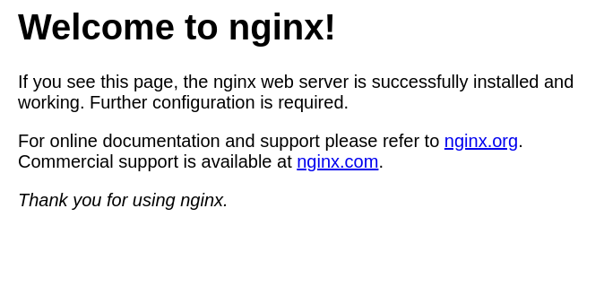

# Preignition_Machine - Basics of penetration testing .

**In our journy to learn penetration testing basics we will take a machines in HTB to can explain the basics of penetration** 

## Every machine has a basic idea to deliver to you .

- in this machine you will learn the basics of dealing with websites attcks and the basics techniqe to get inside the website.

- in this machine you should get familiar with digging tools like `gobuster` and know how it works and how it run in your terminal.

### Enumeration .

- After connecting with vpn you will spawn the machine and you will have the ip address for this machine .

- As we explained in earlier machines you must know how to download vpn and connect with HTB server and ping for IP_address .

- We will skip all this and begin with `nmap` searching to check if we have any open ports . 

- if we find any open ports we will search about any service runing on this ports and try to use it to get in the machine .

- In the next image you will learn the nmap command we will use in this scan, by the way this is the most nmap command I prefer to use.

***NMAP SCAN***

- As you can see in the previous image we find `80/tcp port` are open , we will look to every possible information about this port :

	-  PORT 80/tcp  : the open service is `http` , the version of this service is `nginx 1.14.2` .

		- when you see open port with `http` service you must put in your mind that you will deal with webserver or website .

- because we find the `http service` now go to your browser and type this line `10.129.206.119:80` in search bar .

	- this refer to IP_address_machine:80 , `80` refer to the open port and this will be your your window to go online to deal with the 
	  website .

### foothold .

- As you can see in the next image .

- Now click enter then click continue to site , then you should have the output in website as following .

- And here we are gonna try something depend in my experience , I will try to guess any related websites names which are linked with   
  this IP_address , do not get confused and study the next image .

- As you can sea in the previous image I guessed that the login page for the admin will be stored in a linked page with the same 
  IP_address but added with ip `admin.php` , and that was right .

- when you reached to this page you almost solved the machine , and I need you to be more strong with finding every linked pages with one page and in the next steps i will make you deal with tool which will guess all the right linked page then you test them sequencely .

#### USED TOOLS .

- Make it rule for yourself : "to make any attack you need amount of specific tools" .

- So , you need to ask yourself right now "what is the specific tool which I need to make an attack in this machine " .

- The answer for this question is `gobuster` tool ,Gobuster is a tool used to brute-force URIs including directories and files as well 
  as DNS subdomains.

- this tool Classified from the most used  tool in websites attacks , try to search separatly to know more and more about this tool .

***downloading gobuster***

- First, you need to make sure you have Go installed on your Linux distribution, which is the programming
  language used to write the gobuster tool. Once all the dependencies are satisfied for Go, you can proceed to
  download and install gobuster. In order to install Go, you need to input the following command in your
  terminal window:

- follow the following commands in sequence :
	
	- `sudo apt install golang-go` , to install go language,  If you have a Go environment ready to go (at least go 1.16), it is as easy 
	  as typing in the following command in your terminal: .

		- `go install github.com/OJ/gobuster/v3@latest` ,In case this fails, you can always compile the tool from its' source code by 
	      running the following commands:	

	    	- `sudo git clone https://github.com/OJ/gobuster.git` .
        	
        	- `cd gobuster`
			
			-  `go get && go build`
			
			-  `go install`

##### USNIG GOBUSTER .

- firstly type `gobuster -h` in your terminal, to get the help page to know how to deal with gobuster  .

- in our case we will use the next options only:

	- dir : specify we are using the directory busting mode of the tool.
	
	- w : specify a wordlist, a collection of common directory names that are typically used for sites.
	
	- u : specify the target's IP address .

- run this commmand in your terminal `sudo gobuster dir -w /usr/share/wordlists/dirb/common.txt -u {IP_address}` . 

- As you can see in the previous image the linked directory in the same ip is the same directory I guessed in the first place .

- now you know how to find the linked urls in the same IP , now you have the directory `admin.php` .

- go in the browser and type `IP_address:admin.php`  and we already done this before , but now we will continue to get the flag .

- now you should search for the default credentials for nginx , and you will find that user_name: "admin" and pass: "admin" .

- now we will try those credentials in the login page and watch what will happen .

- click Enter .

- You should have a page like this :

- And here you have the flag and solved the machine .

***Congratulations , Assem_Ayman_44***